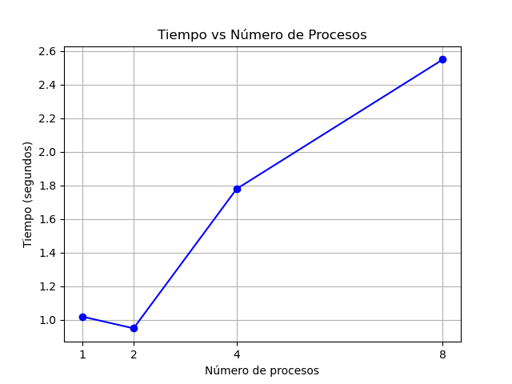

# Reporte Laboratorio 15: Producto Punto con MPI

**Materia:** Física Computacional 
**Estudiante:** Adrian Esteban Boza Castillo. 
**Fecha:** 26 de junio de 2026

## Objetivo
Calcular el producto punto de dos vectores usando programación paralela con MPI, medir tiempos con 1, 2, 4 y 8 procesos, y analizar el rendimiento.

## Funcionamiento
- Cada proceso calcula el producto parcial de su parte del vector.
- Con mpi, se suman todos los resultados en el proceso 0, que es el único que simprime.
- Se mide el tiempo solo del cálculo de los procesos.

## Resultados y Análisis

| Procesos | Tiempo (s) | Resultado |
| :------: | :--------: | :-------: |
|    1     |    1.13    |  128000   |
|    2     |    0.97    |  128000   |
|    4     |    1.80    |  128000   |
|    8     |    2.58    |  128000   |

### Gráfica

**Análisis:**
- El resultado es **siempre correcto (128000)**.
- El **mejor tiempo fue con 2 proceso**.
- Al aumentar procesos, el tiempo sube por:
  - **Sobrecarga de comunicación**: Los procesos pierden tiempo comunicandose entre ellos.
  - **Hardware virtual limitado**: Mi computadora es obsoleta por lo que en vez de trabajar en paralelo por el poco procesamiento que tiene se turna para trabajar en cada proceso.

---

## Conclusión
La paralelización **no mejoró el rendimiento** la comunicación y las limitaciones de la máquina virtual se comen el beneficio de repartir el trabajo. Para mi computadora, **la versión secuencial es más rápida**.

